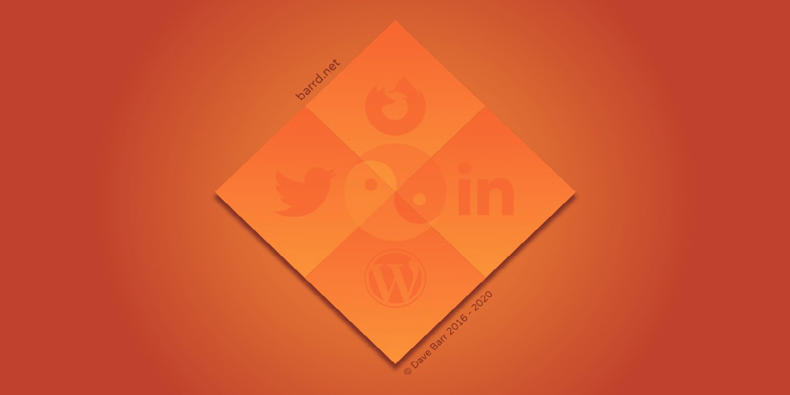

# [barrd.net](https://barrd.net/)

 

You are welcome to view, clone or download this source code.

**Features**

- Compile, minify, autoprefix, create sourcemap and rename .min Sass.
- Watch for file changes, and automatically recompile build and reload webpage.

## Getting Started

### Dependencies

Make sure these are installed first.

- [Node.js](http://nodejs.org)
- [Gulp Command Line Utility](http://gulpjs.com) `npm install --global gulp-cli`

### Quick Start

1. In terminal, `cd` into your project directory.
2. Run `npm install` to install required files and dependencies.
3. When it's done installing, run the task runner to get going:
4. `gulp watch` automatically compiles files and applies changes using [BrowserSync](https://browsersync.io/) when you make changes to your source files.

## About The Author

- **Dave Barr**
- barrd at barrd.dev

## Licence

The code is available under the [MIT License](LICENCE.md).

## Profile View Counter

